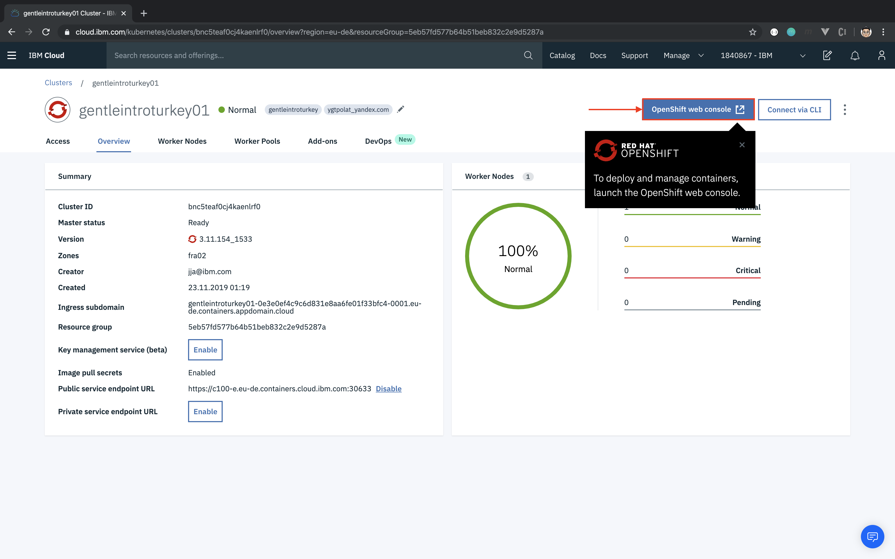
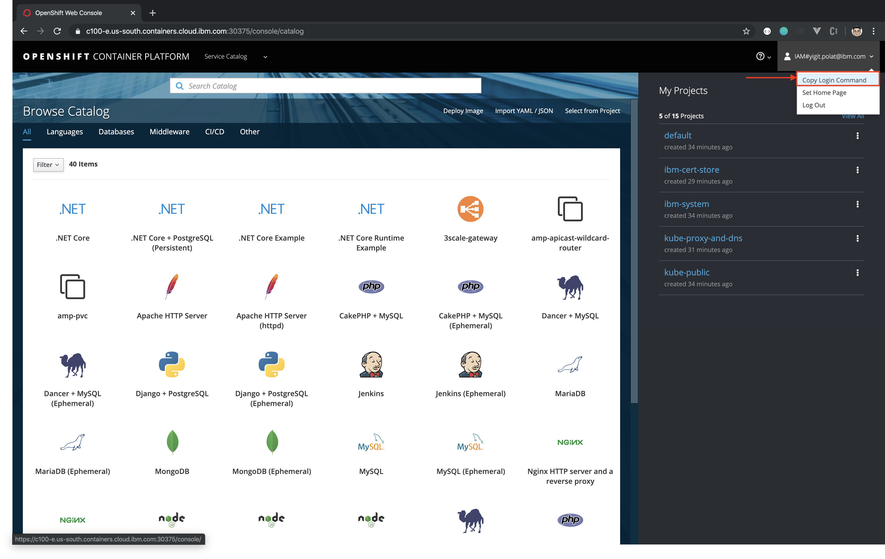
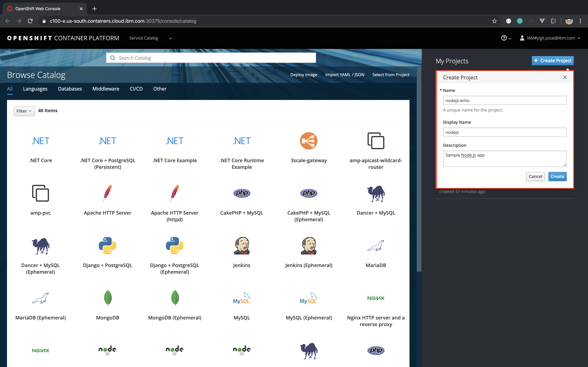

# Lab 1. Creating OpenShift projects

Learn how to login to an OpenShift cluster and create a new project.

You should have a default project setup already but we will create a new project for our new application.

## Login to an OpenShift cluster





```
$ oc login <your-cluster-url> --token=<your-token>
```

As you will be able to see, there are several projects available to be able to switch between different workloads.

## Option 1: Create a project using the Command Line Interface

```
$ oc new-project nodejs-echo --display-name="nodejs" --description="Sample Node.js app"
```

Now you should have a new project and your active project will now point to it. If you want to switch between projects, run:

```
$ oc project <project-name>
```

## Option 2: Create a project using the Web Console



Congratulations, you have logged into your cluster and have created your first OpenShift project! To learn how to create your first application move on to the next lab [Lab 2](../Lab2/README.md).

## References

[Projects](https://docs.openshift.com/container-platform/3.11/dev_guide/projects.html)