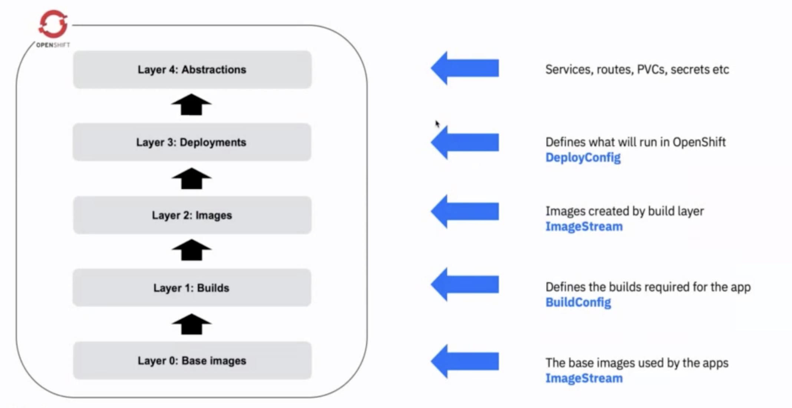
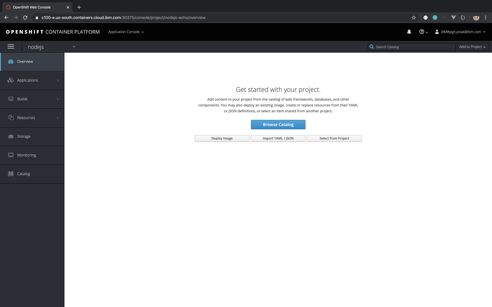

# Lab 2: Creating OpenShift applications

After creating a project as instructed in the [previous lab (Lab 1)](../Lab1/README.md), the next step is to create an OpenShift application in the cluster.

## Option 1: Creating an Application Using the CLI

### Creating an Application From Source Code

With `oc new-app` command, you can create an application in OpenShift from some existing source code either locally or with the url to the repository. If a source repository is specified, `new-app` will check to see which build strategy to use (**Docker** or **Source**).

With the former, a runnable image is created, whereas as the latter, `new-app` will try to identify the language by looking at the files in the project's root directory and then use an appropriate builder.

To build from source:
```
$ oc new-app https://github.com/sclorg/nodejs-ex
```



Clean Up Environment
```
$ oc delete all --all
```

You can override the image the builder uses for a particular source repository by specifying the image and the repository, with a ~ as a separator.
```
$ oc new-app myproject/my-image~path/to/local/or/remote/repository.git
```

> Note: If using a local Git repository, the repository should have a remote named origin that points to a URL accessible by the OpenShift Container Platform cluster. If there is no recognised remote, new-app will create a binary build.

If a Dockerfile is found, OpenShift Container Platform generates a Docker build strategy.

To build from a local Dockerfile:
```
$ oc new-app https://github.com/openshift/ruby-hello-world
```

Clean Up Environment
```
$ oc delete all --all
```

You can override the build strategy by setting the --strategy flag.
```
$ oc new-app /path/to/local/or/remote/repository.git --strategy=(docker|pipeline|source)
```

### Creating an Application From an Image

Similar to Docker, OpenShift is also configured to the public image registry DockerHub. If you specify an image that exists in DockerHub, the `new-app` command will create a runnable image directly from this image.

For example, if you wanted to create an app from the official nginx image, you would run:
```
$ oc new-app nginx
```

Clean Up Environment
```
$ oc delete all --all
```

You are not limited to the DockerHub registry, however - as with Docker, you are able to specify images that are stored in private registries too:
```
$ oc new-app myregistry:8000/example/image
```

You can create an application from an existing image stream and optional image stream tag:
```
$ oc new-app my-stream:v1
```

### Creating an Application From a Template

OpenShift templates are basically starter applications that have been configured ready for OpenShift. These cover frequently used applications deployed in containers e.g. Ruby, Node and MongoDB.

To list available templates:

```
$ oc get templates -n openshift
```

To deploy it, you can run:

```
$ oc new-app postgresql-ephemeral -e POSTGRESQL_USER=admin, POSTGRESQL_PASSWORD=admin, POSTGRESQL_DATABASE=mydb
```

Clean Up Environment
```
$ oc delete all --all
```

## Option 2: Creating an Application Using the Web Console

If you're not a fan of the cli and wanted a more visual way of deploying applications in your cluster, you also have the option of using the OpenShift console.



Congratulations! You have learnt several ways to create applications in OpenShift! To see how we can manage our applications in OpenShift, let's continue on to the [next Lab (Lab 3)](../Lab3/README.md)

## References
[Creating New Applications](https://docs.openshift.com/enterprise/3.1/dev_guide/new_app.html#using-the-web-console-na)