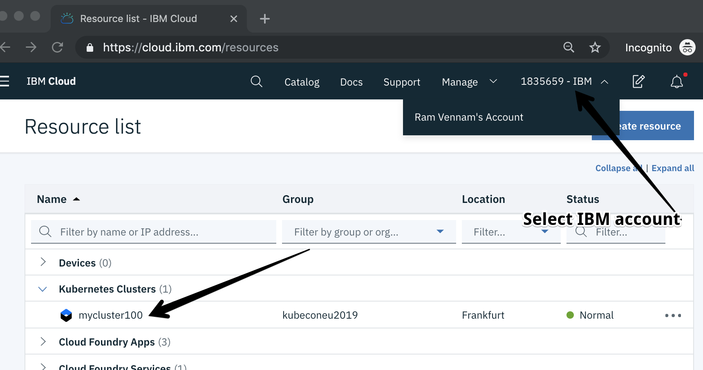

# Create an IBM Cloud Account

Sign up for IBM Cloud or log in here: https://ibm.biz/trmeetup39

Activate your account by clicking on the confirmation link in the email.

# Claiming Your Red Hat OpenShift Cluster

For the purpose of this workshop organizers pre-provisioned for attendees free Red Hat OpenShift Clusters. 

Specs: 1 Worker Node - 4 CPU - 16GB RAM

To claim your cluster, navigate to https://gentleintroturkey.mybluemix.net

# Accessing Red Hat OpenShift Cluster

Log in [IBM Cloud](https://ibm.biz/trmeetup39)

Select the lab account where you have been invited

Navigate to Clusters.

Select the cluster named **gentleintroturkey01**

# Accessing Command Line Interface

During this workshop, you will use predefined environment in a terminal available over web browser.

To access terminal, navigate to https://workshop.shell.cloud.ibm.com/

Once you are all set up, you can move on to [Lab 1](./Lab1/README.md)
